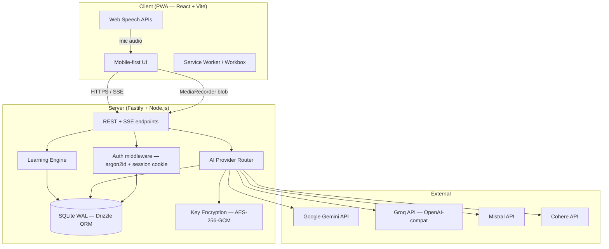
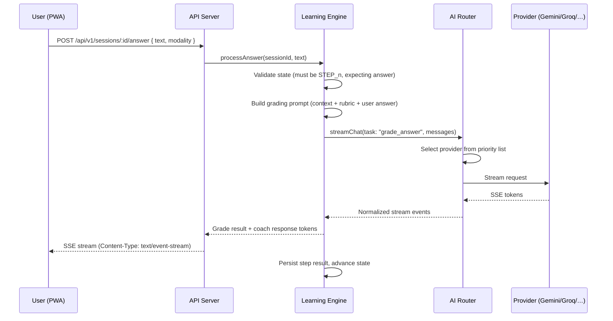
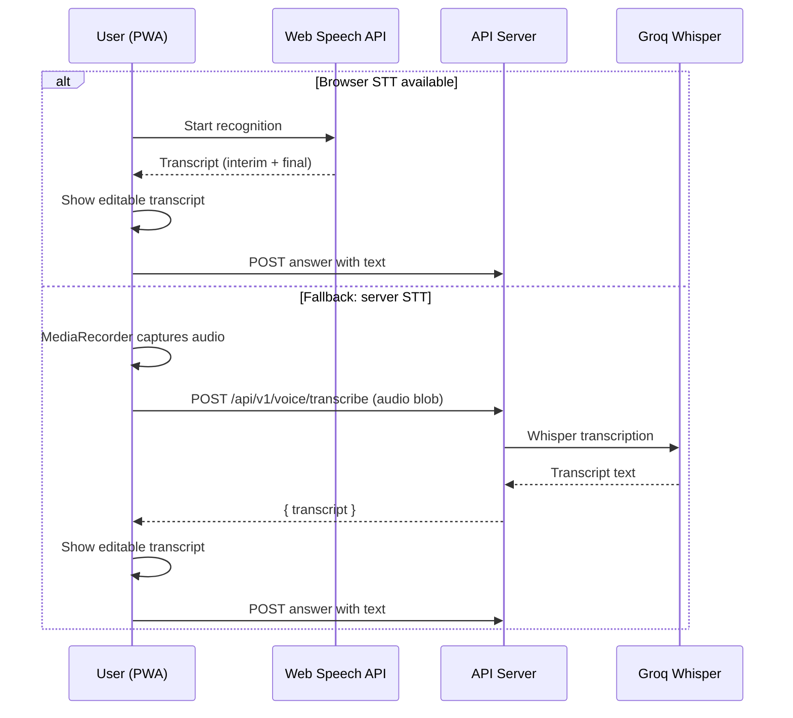
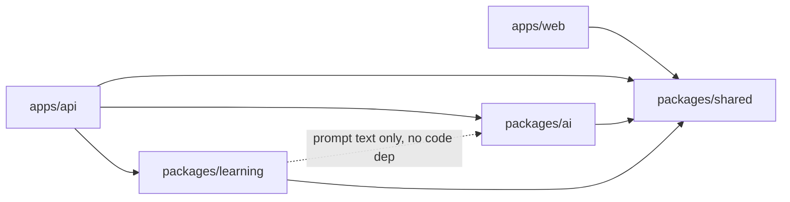
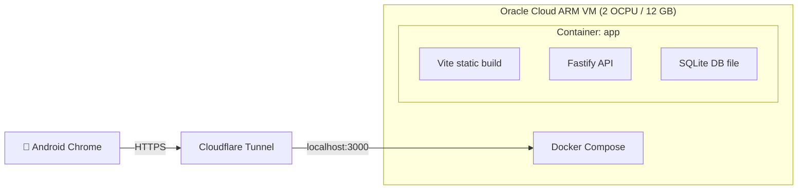
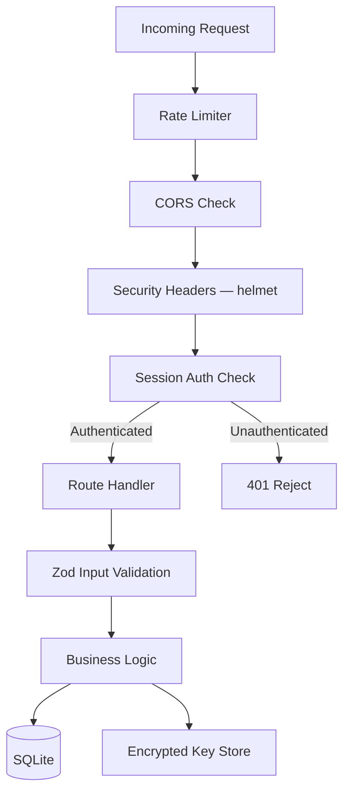

# Architecture — Mindset

> **Phase 0 — Discovery and Design** · v0.1 · 2026-09-29

---

## 1. System Overview

Mindset is a single-user, private PWA that teaches engineering thinking through
AI-coached sessions. The system has two main deployable units — a React PWA
(client) and a Fastify API server — sharing types and validation schemas via
internal packages, all managed in a pnpm monorepo.



---

## 2. Monorepo Layout

```
build-mindset/
├── apps/
│   ├── web/                  # React + Vite PWA (TypeScript strict)
│   │   ├── src/
│   │   │   ├── components/   # UI components
│   │   │   ├── pages/        # Route pages
│   │   │   ├── hooks/        # Custom React hooks
│   │   │   ├── stores/       # Zustand UI stores
│   │   │   ├── api/          # TanStack Query hooks + fetch wrappers
│   │   │   ├── voice/        # Web Speech wrappers (STT + TTS)
│   │   │   └── styles/       # Tailwind config, globals
│   │   ├── public/
│   │   └── vite.config.ts
│   │
│   └── api/                  # Fastify server (TypeScript strict)
│       ├── src/
│       │   ├── routes/       # Route modules
│       │   ├── middleware/    # Auth, rate-limit, security
│       │   ├── services/     # Business logic
│       │   ├── db/           # Drizzle schema, migrations, repo interfaces
│       │   └── plugins/      # Fastify plugins (pino, helmet, cors, etc.)
│       └── drizzle.config.ts
│
├── packages/
│   ├── shared/               # Zod schemas, TS types, constants, errors
│   ├── ai/                   # LLM provider adapters, router, circuit breaker
│   └── learning/             # Prompts, rubrics, state machine, topic catalog
│       ├── prompts/          # Versioned prompt files
│       ├── rubrics/          # Scoring rubric configs
│       ├── topics/           # Topic catalog data
│       └── framework/        # 10-step framework config
│
├── docs/                     # All project documentation
│   └── adr/                  # Architecture Decision Records
├── scripts/                  # Dev/ops (seed, backup, key rotation)
├── docker-compose.yml
├── Dockerfile
├── .env.example
├── pnpm-workspace.yaml
└── turbo.json                # Turborepo for task orchestration
```

---

## 3. Data Flow

### 3.1 Session Chat (Streaming)



### 3.2 Voice Input Flow



---

## 4. Module Boundaries and Dependencies



**Rule:** No circular dependencies. `packages/shared` depends on nothing
internal. `packages/ai` and `packages/learning` depend only on `shared`.
`apps/*` depend on packages but never on each other.

---

## 5. Key Technical Decisions (Summary — see ADRs)

| # | Decision | See ADR |
|---|----------|---------|
| 1 | Fastify over Hono for the server framework | ADR-001 |
| 2 | SQLite (WAL) + Drizzle ORM with repository pattern | ADR-002 |
| 3 | Groq as the fourth provider (OpenAI-compatible adapter) | ADR-003 |
| 4 | Oracle Cloud Always Free for hosting (recommended) | ADR-004 |
| 5 | SM-2 algorithm for spaced repetition | ADR-005 |
| 6 | Browser Web Speech API primary, Groq Whisper fallback | ADR-006 |
| 7 | Turborepo for monorepo task orchestration | ADR-007 |

---

## 6. Deployment Architecture

### Recommended: Oracle Cloud Always Free + Cloudflare Tunnel



**Why Oracle Cloud + Cloudflare Tunnel:**
- **Free forever** — Oracle's Always Free ARM tier provides 2 OCPUs, 12 GB RAM,
  200 GB storage at no cost. More than enough for a single-user app.
- **Always-on** — Unlike Render/Railway/Fly.io free tiers, it doesn't spin down.
- **Persistent storage** — SQLite file lives on block storage, survives restarts.
- **Free HTTPS** — Cloudflare Tunnel provides HTTPS with no manual cert management,
  which is required for PWA install and microphone access.
- **Private** — Tunnel is not publicly discoverable; only you have the URL.
- No credit card needed after initial OCI account setup.

**Alternative option (documented in DEPLOYMENT.md):** Home PC + Tailscale for
private mesh VPN access. Simpler but depends on your PC being on 24/7.

---

## 7. Security Architecture



- **Single-user passphrase:** argon2id hash, HttpOnly/Secure/SameSite=Strict cookie.
- **API keys encrypted at rest:** AES-256-GCM, master key from `ENCRYPTION_KEY` env var.
- **Keys never returned in full:** only `****last4` to the client.
- **Prompt injection defense:** all model output treated as untrusted data. No
  model-triggered privileged actions. Tool surface is zero (no function calling).
- **Brute-force protection:** progressive lockout after N failed login attempts.
- Full threat model in `docs/SECURITY.md`.

---

## 8. API Design Principles

- All endpoints under `/api/v1/`
- Consistent error shape: `{ error: { code, message, details? } }`
- Streaming via SSE on `GET /api/v1/sessions/:id/stream`
- Pagination: cursor-based for lists
- Idempotency keys for mutating operations where sensible
- Request IDs (`X-Request-Id`) propagated through logs
- Input validated with Zod schemas from `packages/shared`
- See `docs/API.md` for the full OpenAPI spec (Phase 1+ deliverable)

---

## 9. Performance Budget

| Metric | Target |
|--------|--------|
| First token from LLM | < 2s (healthy provider) |
| Time to Interactive (PWA) | < 3s on mid-range phone |
| JS bundle (gzipped) | < 150 KB initial |
| Lighthouse Performance | ≥ 90 |
| SQLite query time (typical) | < 10ms |

---

## 10. Risks and Mitigations

| Risk | Impact | Mitigation |
|------|--------|------------|
| Free-tier quota exhaustion mid-session | User can't finish lesson | Multi-provider fallback + request budgeting + caching topic defs |
| Oracle Cloud "out of capacity" on signup | Can't provision VM | Document retry strategy; provide Tailscale alternative |
| Web Speech API inconsistent on iOS Safari | Voice input broken | Groq Whisper server fallback; clear UI states |
| LLM grading inconsistency across providers | Scores not comparable | Calibration test set; rubric anchors; prefer one provider for grading |
| SQLite data loss on crash | Lost learning history | WAL mode + periodic encrypted backups |
| Prompt injection via user input | AI leaks answers early | System prompt guardrails + output validation + no tool calling |
