# Data Model — Mindset

> **Phase 0 — Design** · v0.1 · 2026-09-29

---

## ER Diagram

```mermaid
erDiagram
    USER {
        integer id PK "Always 1 (single-user)"
        string display_name
        string level "junior | mid | senior"
        boolean bridge_language_enabled
        string voice_preference "en-US | en-GB"
        float voice_speed
        string theme "system | light | dark"
        integer streak_current
        integer streak_longest
        date streak_last_date
        datetime created_at
        datetime updated_at
    }

    CREDENTIAL {
        integer id PK
        string passphrase_hash "argon2id"
        datetime last_login
        integer failed_attempts
        datetime locked_until
        datetime created_at
        datetime updated_at
    }

    SESSION_AUTH {
        string id PK "UUID"
        string token_hash
        datetime expires_at
        string ip_address
        string user_agent
        datetime created_at
    }

    PROVIDER_CONFIG {
        string id PK "gemini | groq | mistral | cohere"
        string display_name
        blob api_key_encrypted "AES-256-GCM"
        string api_key_iv
        string api_key_last4
        string model_chat
        string model_fast
        string model_transcribe
        string base_url
        integer priority "lower = preferred"
        string status "active | resting | disabled"
        datetime resting_until
        datetime last_success
        datetime last_error
        string last_error_message
        datetime created_at
        datetime updated_at
    }

    USAGE_STAT {
        integer id PK
        string provider_id FK
        date stat_date
        integer requests_total
        integer requests_success
        integer requests_error
        integer tokens_input
        integer tokens_output
        integer errors_429
        integer errors_5xx
        integer errors_timeout
    }

    TOPIC {
        string id PK "slug, e.g. auth-email-password"
        string title
        string category
        string difficulty "beginner | intermediate | advanced"
        json prerequisites "string[]"
        json learning_objectives "string[]"
        json key_tradeoffs "string[]"
        json common_pitfalls "string[]"
        string transfer_topic_id FK
        integer estimated_minutes
        boolean is_custom
        boolean is_active
        datetime created_at
    }

    LEARNING_SESSION {
        string id PK "UUID"
        string topic_id FK
        string state "State machine phase"
        string level
        boolean quick_mode
        json steps_to_run "number[]"
        integer current_step
        string step_sub_state
        integer hint_level
        json rolling_summary
        float overall_score
        json dimension_scores
        float transfer_score
        float recap_score
        integer total_hints_used
        integer time_minutes
        datetime started_at
        datetime last_active_at
        datetime completed_at
    }

    SESSION_STEP {
        string id PK "UUID"
        string session_id FK
        integer step_number
        string step_slug
        integer attempts
        integer hints_used
        float score
        json grade_result "StepGrade"
        text user_answer
        text coach_question
        text model_answer
        text teaching_response
        string provider_used
        integer tokens_input
        integer tokens_output
        datetime started_at
        datetime completed_at
    }

    MESSAGE {
        string id PK "UUID"
        string session_id FK
        string role "user | coach | system"
        text content
        string modality "text | voice"
        string provider_used
        integer tokens_input
        integer tokens_output
        integer step_number
        datetime created_at
    }

    SKILL_SCORE {
        string id PK "UUID"
        string dimension "problemFraming | dataDesign | etc."
        float score
        string session_id FK
        datetime recorded_at
    }

    REVIEW_ITEM {
        string id PK "UUID"
        string topic_id FK
        integer step_number
        string dimension
        float ease_factor "SM-2, starts at 2.5"
        integer interval_days
        integer repetitions
        datetime next_due
        integer last_quality "0-5"
        datetime last_reviewed
        datetime created_at
    }

    ENGLISH_REPORT {
        string id PK "UUID"
        string session_id FK
        json corrections "Correction[]"
        json technical_vocab "string[]"
        json senior_rewrite "SeniorRewrite"
        text pronunciation_note
        datetime created_at
    }

    ENGLISH_MISTAKE {
        string id PK "UUID"
        string pattern "e.g. 'subject-verb agreement'"
        text example_original
        text example_corrected
        integer occurrence_count
        datetime first_seen
        datetime last_seen
    }

    SETTINGS {
        string key PK
        text value
        datetime updated_at
    }

    AUDIT_LOG {
        integer id PK
        string action "login | logout | key_added | key_rotated | etc."
        string details
        string ip_address
        datetime created_at
    }

    USER ||--|| CREDENTIAL : "has"
    USER ||--o{ SESSION_AUTH : "has active"
    USER ||--o{ PROVIDER_CONFIG : "configures"
    PROVIDER_CONFIG ||--o{ USAGE_STAT : "tracks"
    TOPIC ||--o{ LEARNING_SESSION : "taught in"
    TOPIC ||--o{ REVIEW_ITEM : "reviewed via"
    LEARNING_SESSION ||--o{ SESSION_STEP : "contains"
    LEARNING_SESSION ||--o{ MESSAGE : "records"
    LEARNING_SESSION ||--o| ENGLISH_REPORT : "produces"
    LEARNING_SESSION ||--o{ SKILL_SCORE : "generates"
```

---

## Key Constraints

| Table | Constraint | Rationale |
|-------|-----------|-----------|
| `user` | Max 1 row | Single-user app |
| `credential` | Max 1 row | Single user |
| `provider_config.api_key_encrypted` | Never returned in full | Security |
| `session_step` | Unique (session_id, step_number) | One grade per step |
| `usage_stat` | Unique (provider_id, stat_date) | One row per provider per day |
| `review_item` | Unique (topic_id, step_number) | One review item per step per topic |
| `learning_session.state` | Enum constraint | Valid state machine values only |

## Indexes

| Table | Index | Purpose |
|-------|-------|---------|
| `learning_session` | `(state)` | Find resumable sessions |
| `learning_session` | `(topic_id, completed_at)` | History queries |
| `review_item` | `(next_due)` | Find due reviews |
| `skill_score` | `(dimension, recorded_at)` | Trend queries |
| `usage_stat` | `(provider_id, stat_date)` | Dashboard queries |
| `message` | `(session_id, created_at)` | Chat history |
| `audit_log` | `(created_at)` | Recent activity |

## What Must NOT Be Stored

- Plain-text API keys (always encrypted with AES-256-GCM)
- Full prompts at info log level (debug only)
- Plain-text passphrase (always argon2id hashed)
- Raw audio data (transcribed and discarded)

## Retention

| Data | Retention | Rationale |
|------|-----------|-----------|
| Learning sessions + steps | Forever | Progress tracking |
| Messages | Forever | Re-readable history |
| Audit log | 90 days | Security review |
| Usage stats | 365 days | Trend analysis |
| Review items | Forever (active) | Spaced repetition |

## Migration Strategy

- Drizzle ORM manages all migrations in `apps/api/src/db/migrations/`
- Seed script populates the 50-topic catalog
- Backup script: encrypted SQLite file copy
- Restore: decrypt + replace + restart
